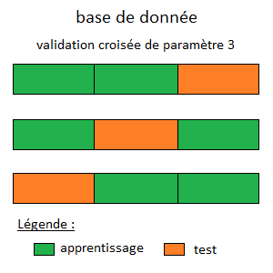

# Description de la problèmatique

Dans le cadre de la nuit de l'info, nous voulons intégrer une intelligence artificielle à notre site web pour faire de la prévention sur les maladie sexuellement transmissible (MST). 

Cette intelligence artificelle ne pourra en aucun cas remplacer l'avis d'un professionnel de santé et una analyse au laboratoire. Cependant, si un utilisateur (notamment les jeunes) se posent des questions, cela pourrais être un moyen d'avoir un avis sur un risque de contamination. (Il est évident qu'un message insitant les utilisateurs à se faire despister en cas de doute sur une éventuelle infection ).
### Principe Général :

Nous voulons mettre a disposition une fonctionnalité qui indique à l'utilisateur s'il y a un risque qu'il soit infecté par une MST. Cette intelligence artificielle retourne une probabilité via un pourcentage. 

### Utilisation :

Pour pouvoir utiliser cette fonctionnalité, l'utilisateur doit saisir des informations. Ces informations seront transmis au modèle qui fera une prédiction. Il est important de dire que les informations sont anonymes et ne seront pas sauvegarde. Une page web dédiée sera consacrée sur le site. Les informations demandées sont issues des différents site officiel comme [ameli](https://www.ameli.fr/assure/sante/themes/mst-ist/symptomes-diagnostic-evolution#text_6515). Il s'agit des informations les plus pertinant pour exprimer un risque d'infection. Sur cette page, l'utilisateur devra renseigner les informations suivantes :

1. (plusieurs choix) des sympôtes ressenties : 

- un écoulement par le pénis 
- des pertes vaginales (vaginite) d'une couleur ou d'une odeur inhabituelles 
- des brûlures en urinant 
- des douleurs lors des rapports sexuels 
- une inflammation des organes génitaux : rougeurs cutanées et augmentation de volume du scrotum (enveloppe des testicules) ou des grandes et petites lèvres du périnée 
- des lésions des muqueuses génitales et/ou de la peau, autour des organes génitaux 
- des douleurs abdominales basses 
- une tuméfaction (ganglions) de l'aine 
- une fièvre
- de la fatigue
2. vous avez plusieurs partenaires sexuels 
3. vous avez déjà été soigné pour une IST
4. vous avez eu des rapports sexuels non protégés 
5. (un choix) catégories sociaux professionnel :
- Agriculteurs exploitants
- Artisans, commerçants et chefs d'entreprise
- Cadres et professions intellectuelles supérieures
- Professions intermédiaires
- Employés
- Ouvriers
- Retraités
- Autres personnes sans activité professionnelle
6. (plusieurs choix) relation sexuelle avec :
- femme
- homme
7. sexe biologique
8. consommation d'alcool (verre par semaine)
9. consommation de drogue (fois par semaine)
10. transfusion sanguine
11. greffe d'organe
12. plaie / blessure récente
13. Nombre de rapport non protégé par semaine
14. Nombre de rapport sexuel par semaine
15. (plusieur choix) pratique sexuelle :
- vaginale
- annale

Après avoir renseigner toutes les informations l'utilisateur devra les confirmer.

Le résultat de notre modèle sera affiché à l'utilisateur. L'affichage du résultat se fera par un pourcentage de risque d'infection. 

### Fonctionnement :

**Important**

Nous n'avons aucunes données pour entrainer notre réseau de neurone. C'est pourquoi, nous allons créer un petit *set* de donnée qui nous servira de s'assurer que notre code tourne. Nous allons, prévoir la possibilité d'entrainer notre modèle dans le cas où on récupère un jeu de donnée complet. Dans la suite de cette partie, nous supposons que nous avons une base de données sur la quelle on peut entrainer notre modèle. 

Une première architecture de réseau de neurone, nous avons choisie une architecture classique. Il s'agit d'un MLP ([Multi Layer Perceptron](https://reunir.unir.net/bitstream/handle/123456789/11569/ijimai20164_1_5_pdf_30533.pdf?sequence=1))
A partir des informations fourni par l'utilisateur, on construit un vecteur $ X \in \mathbb{R}^{26} $, 

Pour la sortie, nous choisissons un vecteur en one-hot encoding. C'est-à-dire une vecteur $Y \in \{0,1\}^2 $ où $Y = \begin{pmatrix} \text{a été infecté} \\ \text{n'a pas été infecté} \end{pmatrix} $, cela vaut 1 dans la classe associée.
<ins> Ce qu'on pourrez faire : </ins>

Pour optimiser les hyper-paramètre de notre architecture, nous choisissons de mettre en place un [grid search](https://link.springer.com/chapter/10.1007/978-3-540-74972-1_17). Nous optimiserons : 
- le nombre de neurones sur chaque couche
- la fonction de loss (Hinge, Cross-Entropy)
- l'algorithme de descente (Adam, rmsprop)

<ins> Choix qu'on a fait:</ins>

1. Architecture : 

On a une couche d'entré de dimension $\mathbb{R}^{26}$, On a 3 couches cachées de dimension : $\mathbb{R}^{50}$, une couche caché de dimension $\mathbb{R}^{25}$ et la couche de sortie de dimension $\mathbb{R}^{2}$ 

2. Les fonctions d'activations :
Sur chaque couche caché, nous utilisons comme fonction de d'activation, la fonction $relu(x)= max(x,0)$. Pour la couche de sorti, nous utilisons la fonction $softmax$ (cela permet d'obtenir une probabilité)

3. La fonction de loss :

Pour la fonction de loss, nous choisissons la cross-entropy. Il s'agit d'une loss courament utilisé pour la classification. 

<ins> Base de donnée : </ins>

Pour rappel, nous avons fait l'hypothèse que nous avons une base de donnée que nous pourrons utiliser pour faire l'apprentissage. 

1. Structure de la base de donnée 

La base de données suit la structure suivante : 

| id | $c_{1,1}$ | $c_{1,2}$ | $c_{1,3}$ | $c_{1,4}$ | $c_{1,5}$ | $c_{1,6}$ | $c_{1,7}$ | $c_{1,8}$ | $c_{1,9}$ | $c_{2}$ | $c_{3}$ | $c_{4}$ | $c_{5}$ | $c_{6,1}$ | $c_{6,2}$ |  $c_{7}$ |$c_{8}$ | $c_{9}$ | $c_{10}$ | $c_{11}$ | $c_{12}$ | $c_{13}$ | $c_{14}$ | $c_{15,1}$ | $c_{15,2}$ | malade |

où $c_i$ correspond à la $i^{\grave{e}me} $ caractéristique renseigner par l'utilisateur (Cf. [Utilisation](#utilisation))

Pour les questions ouvertes ont aura 1 si c'est oui 0 sinon. Pour le sexe biologique, 0 correspond à un homme et 1 à une femme. 

2. Utilisation de la base de donnée

Nous normalisons la base de données avec une standartisation $X = \frac{X - \mu}{\sigma}$ où $\mu$ est la moyenne et $\sigma$ est l'écart-type de notre base de donnée. 
Si nous avons qu'une seul base de donnée, alors on suit la procédure suivante pour la découper :

- On fait un permutation sur toutes les lignes de la base
- On mets en place une cross-validation pour faire l'entrainement. La cross-validation se fait avec un pas de 3. 
- On coupe la base en 3 parts égales. On réalise l'apprentissage sur 2 parties de la base, une partie va servir pour tester notre modèle. Puis on recommence le procédé en changement les parties. Voici une illustration :

Si nous avons plusieurs bases de données alors on utilisera une base de donnée comme base de test. Les autres bases de données serviront à l'apprentissage. On utilise le principe de la cross-validation (avec un pas de 3) sauf que nous faisons un apprentissage sur 2 partie et la dernière partie joue le rôle de base de validation. 

L'avantage d'utiliser une base de validation, c'est que cela permet d'optimiser les hyper-paramètre du modèle.

3. Construction de la base de donnée 

Pour construire une telle base de donnée, nous devons nous rapprocher des services médicaux en utilisant leurs base de données. Une autre solution, pas envisager ni mis en place ici, c'est de laisser la possibilité au utilisateur de remplir leurs informations et d'indiquer s'ils ont été infecté par une IST (Infection Sexuellement Transmissible). L'inconvénient de cette dernière méthode, c'est qu'elle introduit une vulnérabilité. Car elle laisse la possibilité aux utilisateurs de biaiser les données en introduisant des fausses données. 